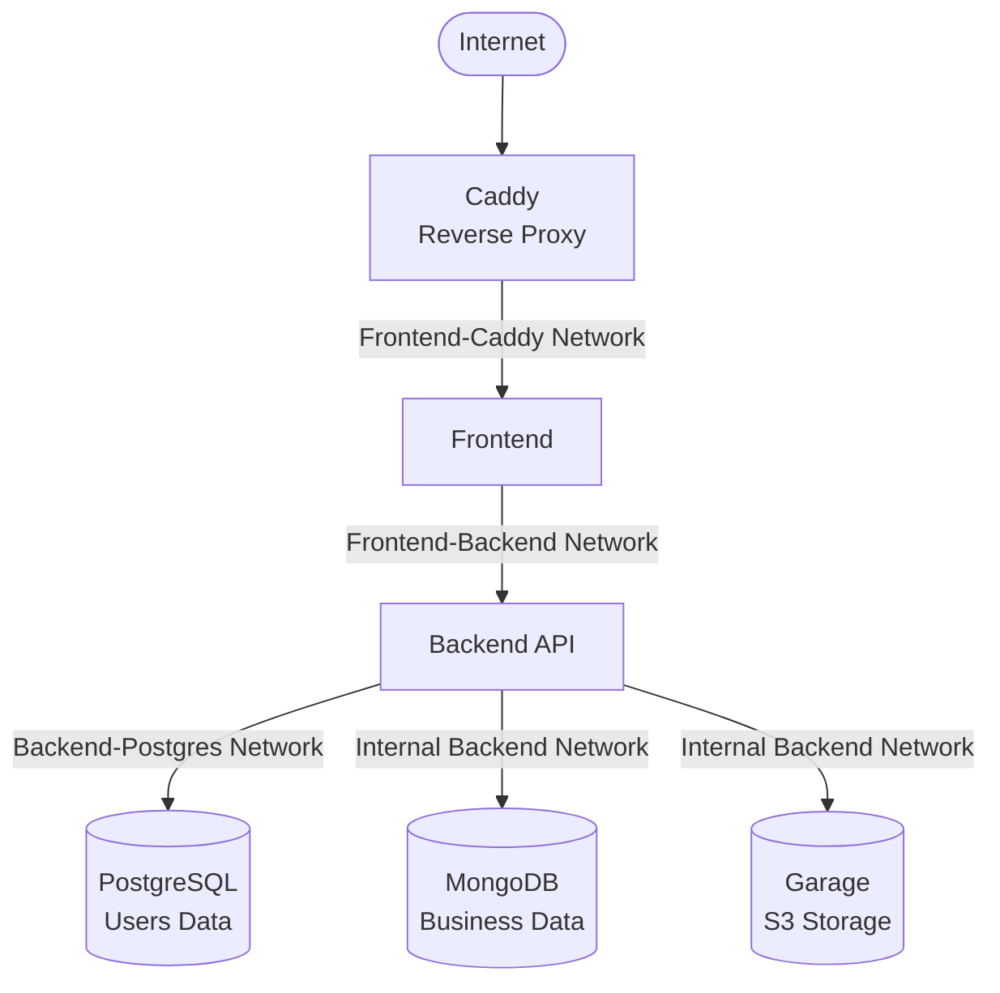
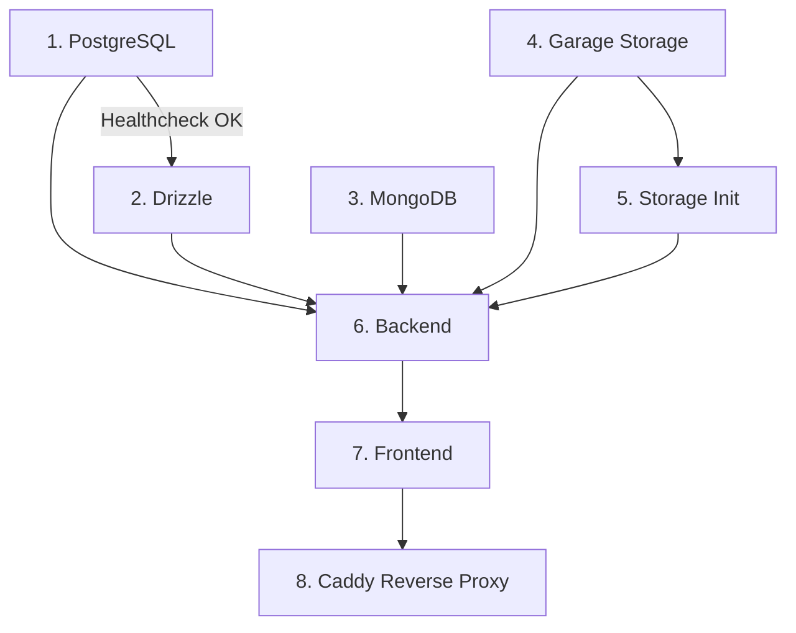

# Architektura systemu Dentist+

## Opis systemu

System został zbudowany w architekturze kontenerowej z wykorzystaniem Docker Compose.  
Aplikacja składa się z kilku odseparowanych usług komunikujących się wyłącznie przez prywatne sieci Dockera.

## Diagram komunikacji




## Sieci Docker

Projekt wykorzystuje wiele odseparowanych sieci Docker Bridge.

### `public`

Sieć publiczna.

Podłączone usługi:

- `caddy`

---

### `frontend-caddy`

Sieć komunikacji między usługą Frontend a usługą Caddy (Reverse Proxy).

Podłączone usługi:

- `frontend`
- `caddy`

---

### `frontend-backend`

Sieć komunikacji między usługą Frontend a usługą Backend.

Podłączone usługi:

- `frontend`
- `backend`
- `caddy`

 Caddy może opcjonalnie być wykorzystywany jako proxy backendu.

---

### `backend-postgres`

Sieć komunikacji między usługą Backend a bazą PostgreSQL.

Podłączone usługi:

- `backend`
- `postgres`

---

### `backend-internal`

Sieć prywatna usługi Backend.

Podłączone usługi:

- `backend`
- `mongo`
- `storage`
- `storage-init`

---

### `drizzle-postgres`

Sieć wykorzystywana wyłącznie do migracji bazy PostgreSQL.

Podłączone usługi:

- `drizzle`
- `postgres`

---

## Usługi

### PostgreSQL

#### Kontener

```yaml
image: postgres:17-alpine
```

#### Rola

Relacyjna baza danych przechowująca:

- dane użytkowników,
- dane logowania.

#### Dostęp

Dostęp posiadają wyłącznie:

- `backend`
- `drizzle`

#### Przechowywanie danych

```yaml
postgres_data:/var/lib/postgresql/data
```

#### Healthcheck

```bash
pg_isready
```

### Struktura danych PostgreSQL

#### Enum `user_role`

```ts
["USER", "DOCTOR", "ADMIN"]
```

#### Tabela `users`

| Pole | Typ | Opis |
|---|---|---|
| id | serial | ID użytkownika |
| email | text | Unikalny adres email |
| passwordHash | text | Funkcja skrótu hasła |
| role | enum | Rola użytkownika |
| active | boolean | Stan konta |
| createdAt | timestamp | Data utworzenia |
| firstName | text | Imię |
| lastName | text | Nazwisko |
| address | text | Adres |
| phoneNumber | text | Numer telefonu |

### Role użytkowników

#### USER

Pacjent systemu.

#### DOCTOR

Lekarz posiadający możliwość obsługi wizyt i procedur.

#### ADMIN

Administrator systemu posiadający wgląd i możliwość zarządzania wszystkimi danymi systemu.

---

### MongoDB

#### Kontener

```yaml
image: mongo:8-noble
```

#### Rola

Baza dokumentowa przechowująca dane aplikacji dotyczące:

- pacjentów,
- wizyt,
- procedur medycznych,
- płatności,
- katalogów zabiegów,
- zdjęć pacjentów.

#### Dostęp

Dostęp posiada wyłącznie:

- `backend`

#### Przechowywanie danych

```yaml
mongo_data:/data/db
```

### Kolekcje MongoDB

#### `Patient`

Przechowuje status uzębienia pacjenta.

##### Pola

| Pole | Typ | Opis |
|---|---|---|
| patientId | Number | ID użytkownika |
| toothStatusList | Array | Statusy poszczególnych zębów |

---

### `ProcedureCatalog`

Katalog dostępnych procedur medycznych.

#### Pola

| Pole | Typ | Opis |
|---|---|---|
| name | String | Nazwa procedury |
| description | String | Opis procedury |
| defaultCost | Number | Domyślny koszt |
| active | Boolean | Stan procedury |
| setsToothStatus | String | Status ustawiany po zabiegu |
| blockedByStatuses | String[] | Statusy blokujące procedurę |
| infoColor | String | Kolor informacyjny |

### `MedicalProcedure`

Wykonana procedura medyczna.

#### Pola

| Pole | Typ | Opis |
|---|---|---|
| patientId | Number | ID pacjenta |
| doctorId | Number | ID lekarza |
| date | Date | Data wykonania |
| description | String | Opis |
| treatments | Array | Lista zabiegów |

### `Visit`

Wizyty pacjentów.

#### Pola

| Pole | Typ | Opis |
|---|---|---|
| doctorId | Number | ID lekarza |
| patientId | Number | ID pacjenta |
| dateTime | Date | Termin wizyty |
| durationMinutes | Number | Długość wizyty |
| description | String | Opis |
| status | Enum | Status wizyty |
| medicalProcedureId | ObjectId | Powiązana procedura |
| cancelledAd | Date | Data anulowania |

#### Statusy wizyt

```ts
["BOOKED", "COMPLETED", "CANCELLED"]
```

### `Payment`

Płatności za zabiegi.

#### Pola

| Pole | Typ | Opis |
|---|---|---|
| patientId | Number | ID pacjenta |
| medicalProcedureId | ObjectId | Procedura |
| amount | Number | Kwota |
| status | Enum | Status płatności |
| token | String | Token płatności |
| successUrl | String | URL sukcesu |
| errorUrl | String | URL błędu |
| paidAt | Date | Data opłacenia |

#### Statusy płatności

```ts
["PENDING", "COMPLETED", "FAILED"]
```

### `PatientImage`

Metadane plików pacjentów.

#### Pola

| Pole | Typ | Opis |
|---|---|---|
| patientId | Number | ID pacjenta |
| s3Key | String | Klucz pliku w storage |
| filename | String | Nazwa pliku |
| mimeType | String | Typ MIME |
| uploadedBy | Number | ID użytkownika tworzącego plik |

---

### Garage Storage (S3)

#### Kontener

```yaml
image: dxflrs/garage:v1.0.1
```

#### Rola

Storage kompatybilny ze standardem API Amazon S3.

Przechowuje:

- zdjęcia pacjentów,

#### Dostęp

Dostęp posiada wyłącznie:

- `backend`
- `storage-init`

#### Porty

| Usługa | Port |
|---|---|
|API S3|3902|
|API Administracyjne|3903|

---

### Storage Init

#### Rola

Jednorazowy kontener inicjalizujący Garage.

Tworzy:

- layout klastra,
- bucket storage,
- access key,
- uprawnienia bucketu.

#### Proces inicjalizacji

1. Oczekiwanie na uruchomienie Garage.
2. Pobranie node ID.
3. Konfiguracja layoutu.
4. Utworzenie bucketu.
5. Utworzenie access key.
6. Nadanie uprawnień.

---

### Drizzle

#### Rola

Kontener odpowiedzialny za migrację danych PostgreSQL.

#### Dostęp

Posiada dostęp wyłącznie do PostgreSQL.

#### Zadania

- inicjalizacja tabel.
- wykonywanie migracji schema,

#### Charakterystyka

Kontener jednorazowy:

```yaml
restart: "no"
```

---

### Backend

#### Rola

Centralna logika biznesowa systemu.

Backend jako jedyna usługa posiada dostęp do:

- PostgreSQL,
- MongoDB,
- Garage Storage.

#### Odpowiedzialność

- autoryzacja użytkowników,
- logika wizyt,
- logika procedur,
- płatności,
- upload plików,
- integracja ze storage.

#### Sieci

```yaml
backend-internal
backend-postgres
frontend-backend
```

---

### Frontend

#### Rola

Warstwa UI aplikacji.

#### Komunikacja

Frontend komunikuje się wyłącznie z backendem:

```text
http://backend:3000
```

#### Brak bezpośredniego dostępu do:

- PostgreSQL,
- MongoDB,
- Garage.

#### Sieci

```yaml
frontend-backend
frontend-caddy
```

---

### Caddy

#### Rola

Reverse proxy umożliwiające zewnętrzny dostęp do usługi Frontend.

#### Funkcje

- routing ruchu,
- udostępnienie aplikacji na Internet,

#### Jedyna publiczna usługa

```yaml
ports:
  - "80:80"
  - "443:443"
  - "443:443/udp"
```

#### Sieci

```yaml
public
frontend-caddy
frontend-backend
```

---

## Bezpieczeństwo architektury

### Izolacja sieciowa

Każda warstwa aplikacji działa w osobnej sieci.

Przykłady:

- frontend nie ma dostępu do baz danych,
- MongoDB nie jest publicznie dostępne,
- PostgreSQL nie jest publicznie dostępne,
- Garage nie jest publicznie dostępne.

---

### Single Entry Point

Jedynym publicznym punktem wejścia jest usługa Caddy.

---

### Backend jako warstwa pośrednia

Backend pełni funkcję:

- warstwy autoryzacji,
- warstwy walidacji,
- warstwy bezpieczeństwa.

---


## Kolejność uruchamiania usług



### Opis zależności

| Usługa | Wymagane zależności |
|---|---|
| PostgreSQL | Brak |
| Drizzle | PostgreSQL (Healthy) |
| MongoDB | Brak |
| Garage | Brak |
| Storage Init | Garage |
| Backend | PostgreSQL, Drizzle, MongoDB, Garage, Storage Init |
| Frontend | Backend |
| Caddy | Frontend |

### Szczegóły działania

1. `PostgreSQL` uruchamia się i przechodzi healthcheck.
2. `Drizzle` wykonuje migracje schematu bazy danych.
3. `MongoDB` uruchamia się niezależnie.
4. `Garage` uruchamia storage S3.
5. `Storage Init` konfiguruje bucket, layout i access keys.
6. `Backend` startuje dopiero po gotowości wszystkich zależności.
7. `Frontend` uruchamia się po backendzie.
8. `Caddy` wystawia aplikację publicznie jako reverse proxy.

## Przechowywanie danych

### PostgreSQL

```yaml
postgres_data
```

### MongoDB

```yaml
mongo_data
```

### Caddy

```yaml
caddy_data
caddy_config
```

### Garage

```yaml
./storage/data/meta
./storage/data/store
```
